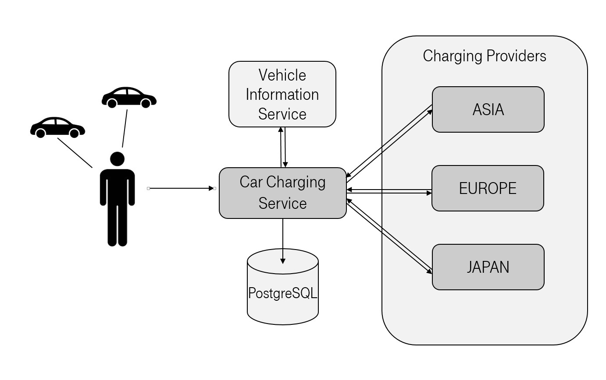
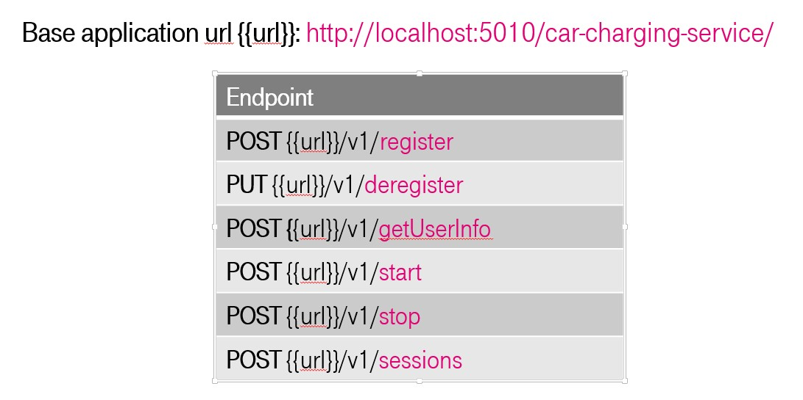
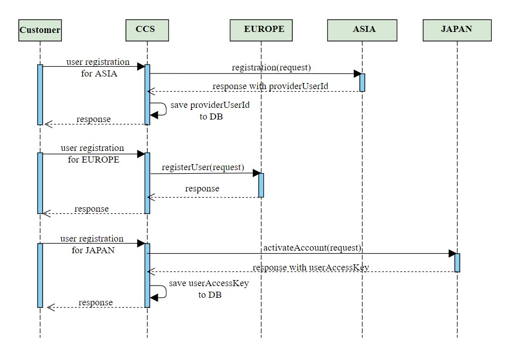
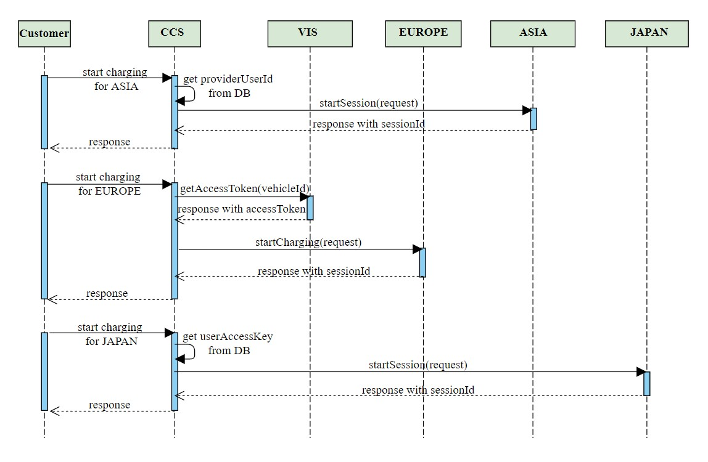

# Repository for "Clean Code" lecture in T-Systems java school

During the lecture, we will gradually improve the application so that from dirty code we come to clean code

## Description

An application "Car charging service" to simulate the start of charging electric vehicles. Adapter between different car brands and charging providers

## Tech Stack
* Java 8
* Spring boot 2.0
* Spring data
* Spring cloud (Feign clients)
* Hibernate
* Liquibase
* PostgreSql database
* H2 in memory for tests

## Installing

Clone this repo to your local machine using https://github.com/emmilletta/car-charging-service-dirty.git

## Getting Started

* With docker
  * download and install docker
  * check that maven profile for docker is ACTIVE
  * use maven install to build project. It will automatically run docker-compose.yml file with PostgreSQL database

* Without docker
  * download PostgreSQL database
  * create database with name "ccs" user = admin, password = admin, define port = 5020 (you also can use other parameters, in this case change properties in block "datasource" in application.yml)
  * check that maven profile for docker is INACTIVE
  * build project with maven

Run CarChargingServiceApplication (In Intellij IDEA select class and use schortcut CTRL+SHIFT+F10)

## System architecture

## Endpoints

## Registration workflow

## Start charging workflow

## Integration Tests

To run IT tests needs to enable the maven "Integration Tests" profile and build the application using maven as usual
 
## License

This project is licensed under the MIT License - see the [LICENSE.md](LICENSE.md) file for details
